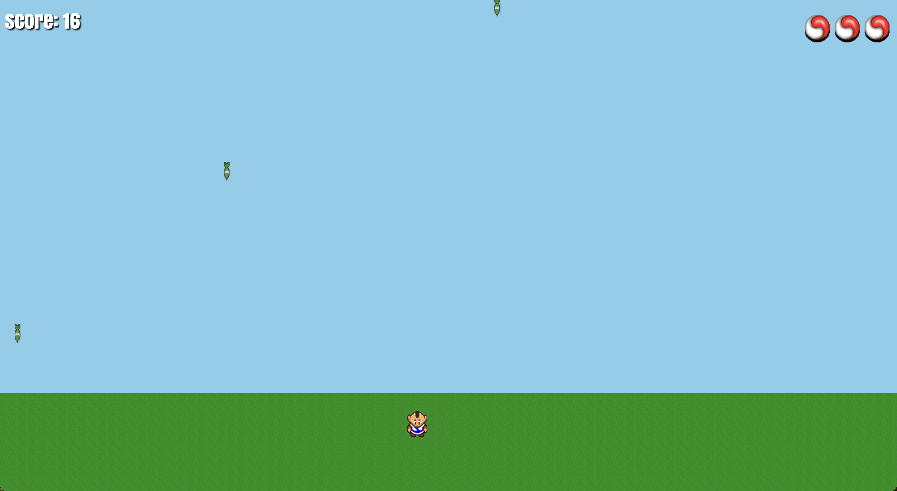

# Dodge the Bomb - JavaScript Game



Welcome to Dodge the Bomb, a simple and addictive JavaScript game! Test your reflexes and see how long you can survive. Dodge falling bombs, stay alive, and aim for the high score!

## Play the Game

You can play the game right now by visiting the following link: [Play Dodge the Bomb](https://suyogkad.github.io/Dodge-the-Bomb---JS/)

## How to Play

1. **Objective:** Dodge the falling bombs and survive as long as possible.

2. **Controls:** Use the left and right arrow keys to move your player left and right.

3. **Health:** You start with 3 lives. If a bomb hits you, you lose 1 life. If you lose all 3 lives, the game is over.

4. **Scoring:** The game speed increases as you survive longer. Challenge yourself to beat your high score!

## Run the Game Locally

To run the game locally on your machine, follow these steps:

1. Clone the project repository:
   ```bash
   git clone https://github.com/suyogkad/Dodge-the-Bomb---JS.git
